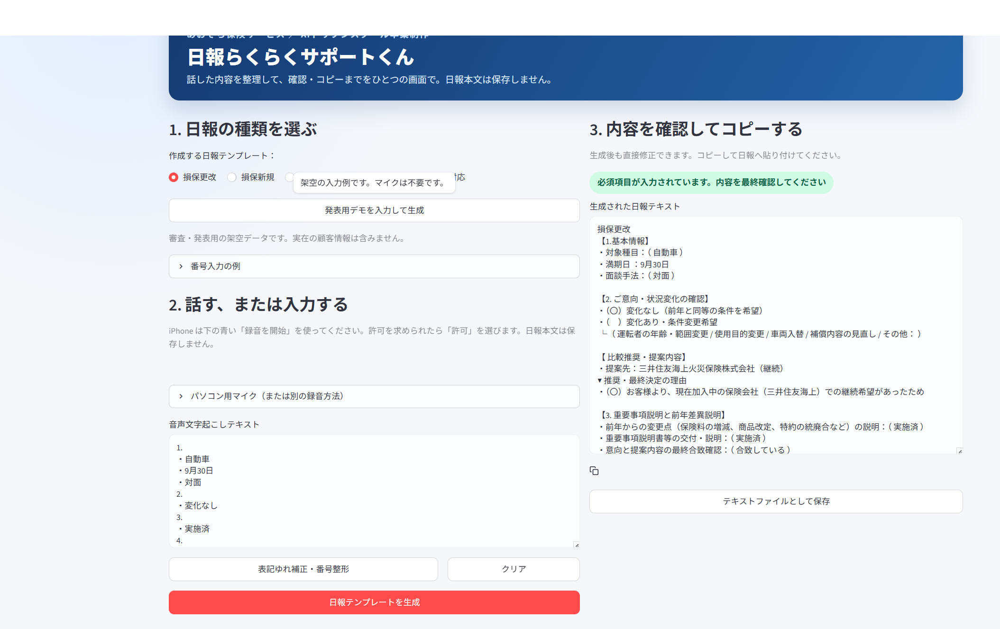

# 日報らくらくサポートくん（らくサポ）

[](https://rakusapo.streamlit.app/)

保険代理店の現場で、商談あとにもう一度キーボードで打ち直していた日報入力を短くするツールです。  
**既存の日報システムは置き換えません。** 話す（または入力する）→会社の型に整える→コピーして貼る、までを担います。

AIドリブンスクール 卒業制作。対象はあおぞら保険サービスの日報フォーマットです。

**公開デモ:** https://rakusapo.streamlit.app/  
**ソース:** https://github.com/yoneken5/rakusapo



## 30秒で試す

1. 上の公開デモを開く
2. 日報の種類を選ぶ（最初は「損保更改」）
3. **発表用デモを入力して生成** を押す
4. 右側のテンプレートを確認し、コピーする

マイクは不要です。デモ入力は架空の内容です。

## できること

- 損保更改 / 損保新規 / 生保新規 / 生保アフター / 苦情対応の5テンプレート
- 番号ガイドに沿った音声入力（PCマイク、iPhone録音、ボイスメモ）
- よく使う用語の補正（例: 「じゅうせつ」→「重要事項説明」）
- 不足番号の警告と、生成後の手直し
- ワンクリックコピー → 既存の日報へ貼り付け

文章の型はめは、業種別のルールパーサーです。ChatGPT のような自由生成ではありません。

## 使い方

1. 日報の種類を選ぶ
2. 番号のガイドを見ながら話す。またはテキストで入れる
3. 必要なら「表記ゆれ補正・番号整形」
4. 「日報テンプレートを生成」
5. 確認してコピーし、今の日報システムへ貼る

社員向けの短い手順は [らくサポ使い方.md](らくサポ使い方.md) にあります。  
6分発表の読み上げ原稿は [プレゼン原稿_日報ラクラクサポートくん.md](プレゼン原稿_日報ラクラクサポートくん.md) です。

## ローカル起動

Python 3.10 以降が必要です。

```powershell
python -m venv .venv
.\.venv\Scripts\Activate.ps1
pip install -r requirements.txt
streamlit run rakusapo_app.py
```

Windows では `start_rakusapo.cmd` をダブルクリックしても起動できます。

## 判定・生成のしくみ

```
音声 ── Google 音声認識（STT）──┐
テキスト入力 ──────────────────┤── 用語補正 ── 番号整形 ── 業種別パーサー ── 日報テンプレ
```

- **音声:** Web / 端末の録音を、サーバー側で Google の音声認識に渡します
- **文章:** 種類ごとの必須項目・キーワード照合。入力にない内容は推測しません（足りない欄は「要入力」）
- **保存:** 日報本文は保存しません。覚えるのは、その端末の用語補正だけです

Streamlit Community Cloud の Main file path は `rakusapo_app.py` です。

## プライバシー

公開デモは URL を知っている人が使えます。次は残しません。

- 日報本文
- 顧客の中身
- 録音データの保管

音声認識の処理は Google のサービスを経由します。公開デモでは個人情報や実在の顧客名を入れないでください。

## テスト

```powershell
pip install pytest
pytest -q
```

## ライセンス

[MIT License](LICENSE)
